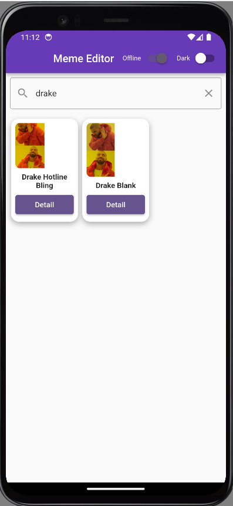
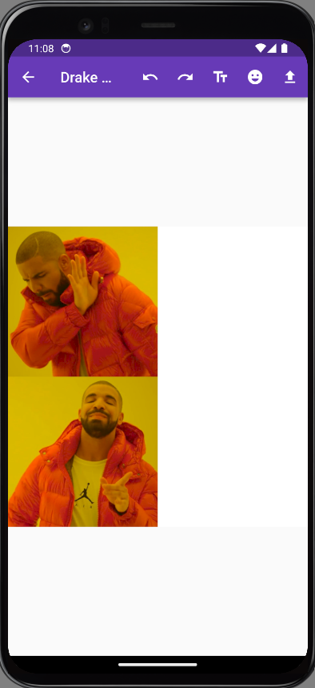
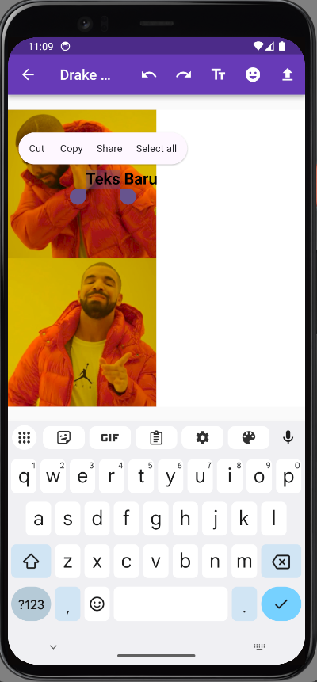
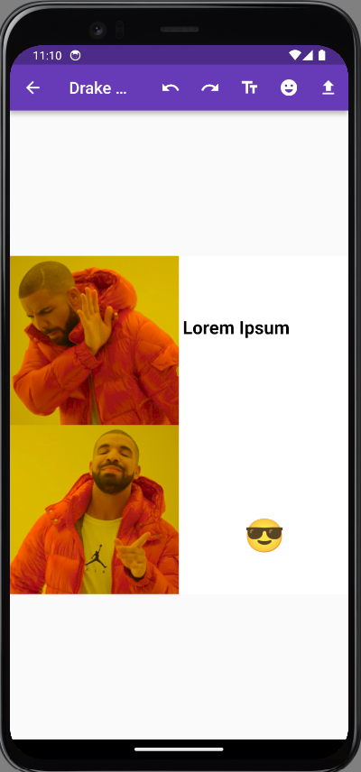
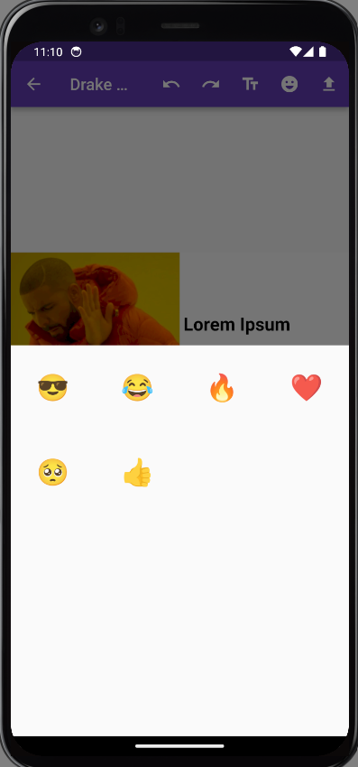
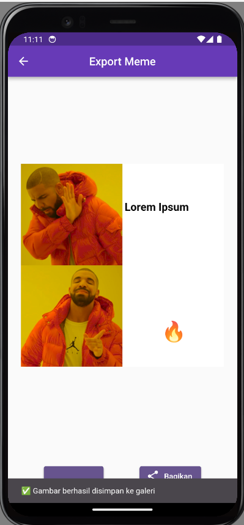
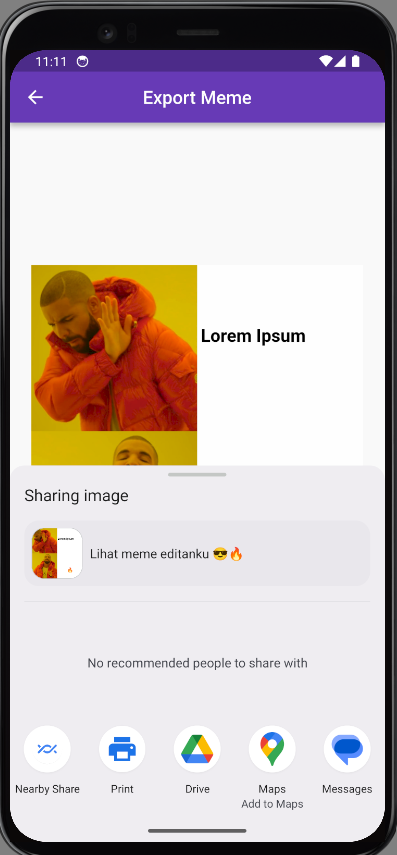
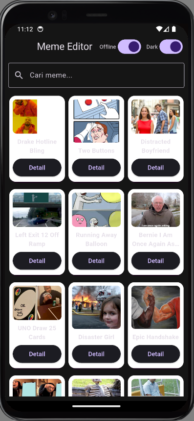

# Meme Editor App

Aplikasi Flutter sederhana untuk mengedit dan menyimpan meme ke galeri.

## 🚀 Cara Menjalankan

1. Jalan kan "git clone https://github.com/username/meme_editor_app.git" untuk mengclone direktori ke lokal

2. Masuk kedalam Code Editor (Visual Studio Code, dll)

3. Run "flutter pub get"

4. Jalankan Emulator

5. Jalankan "flutter run" untuk menjalankan aplikasi Flutter di emulator.

##  Dokumentasi Tampilan
1. Halaman Utama

  

2. Fitur Search

  

3. Halaman Detail

4. Halaman Export

5. Dark Mode

